# Huishouden Home

Keeping the house in good shape, together, from the living-room tablet or anyone's phone.

Live at https://huishouden-piekstra.web.app/home/, also linked from the [Huishouden portal](https://huishouden-piekstra.web.app). The old address, huishouden-home.web.app, redirects there.
Installable on the tablet, phones and laptops, and works offline (changes sync when the connection is back).

## Screenshots

| Overview | Upkeep |
|---|---|
| 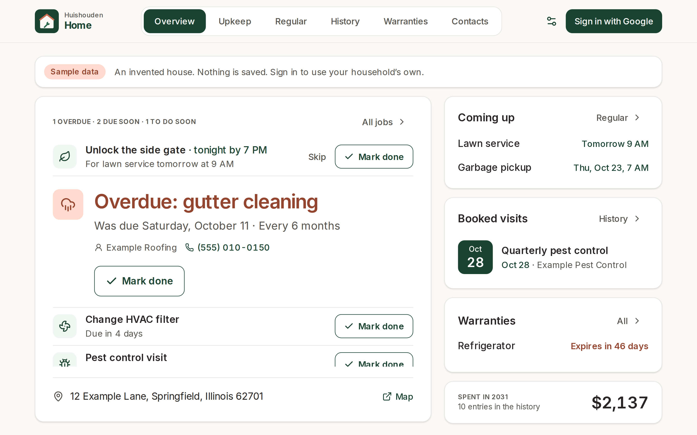 | 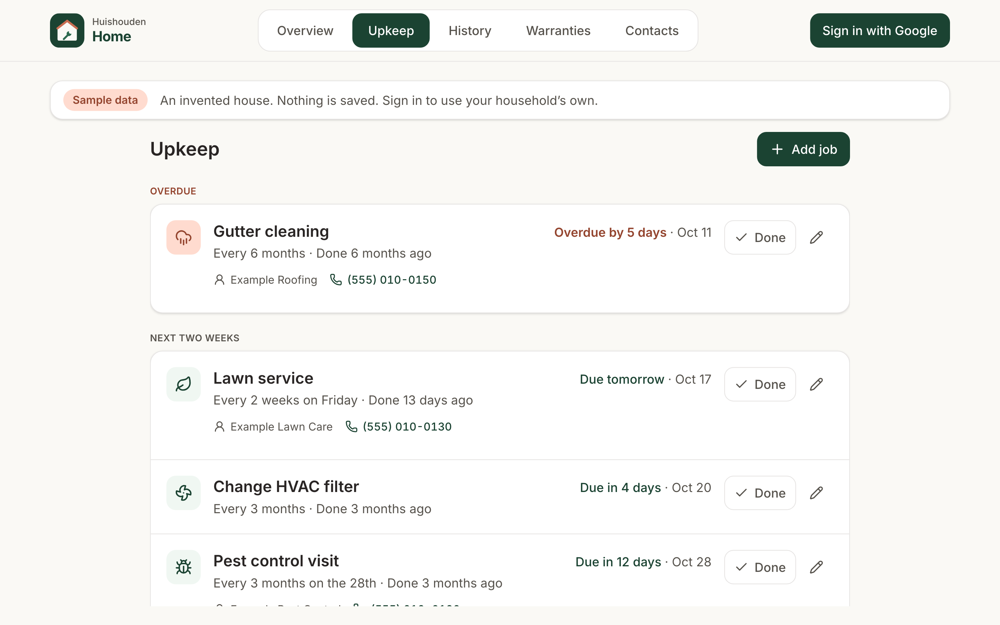 |

| History | Warranties and manuals |
|---|---|
| 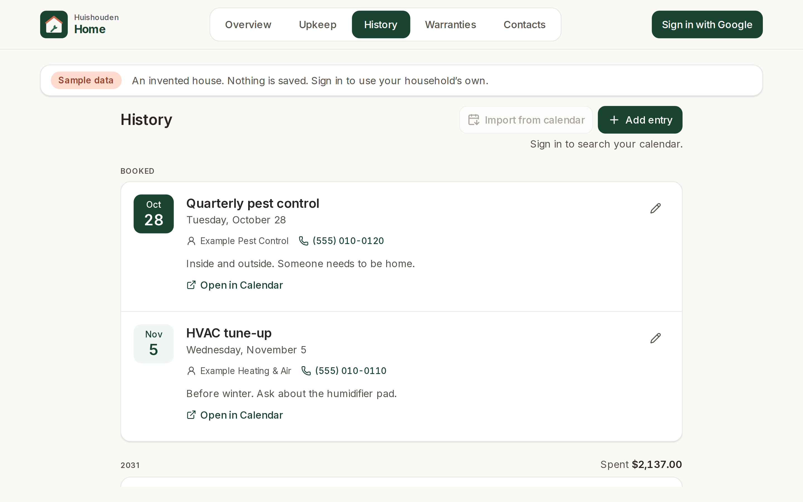 | 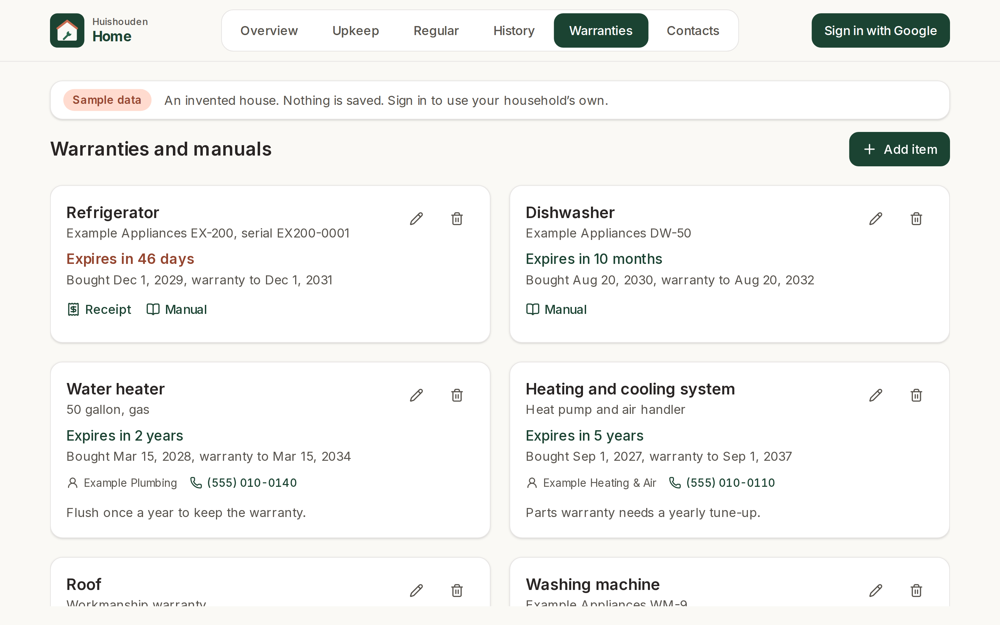 |

| Done, with Undo | A job's schedule |
|---|---|
| 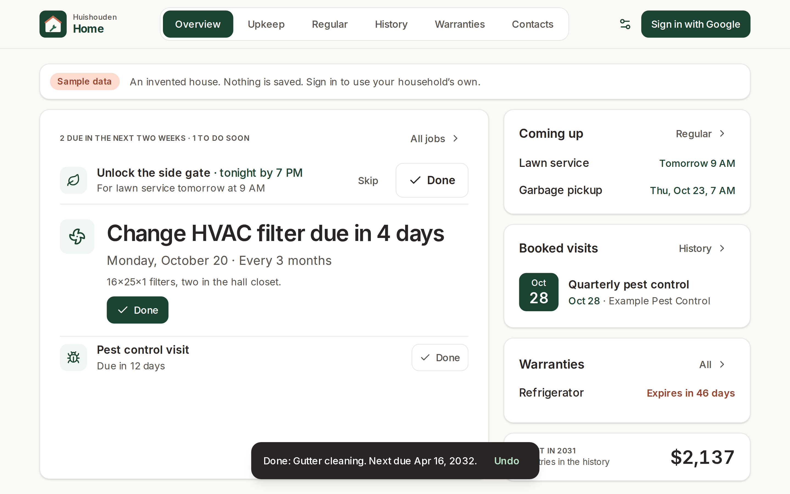 | 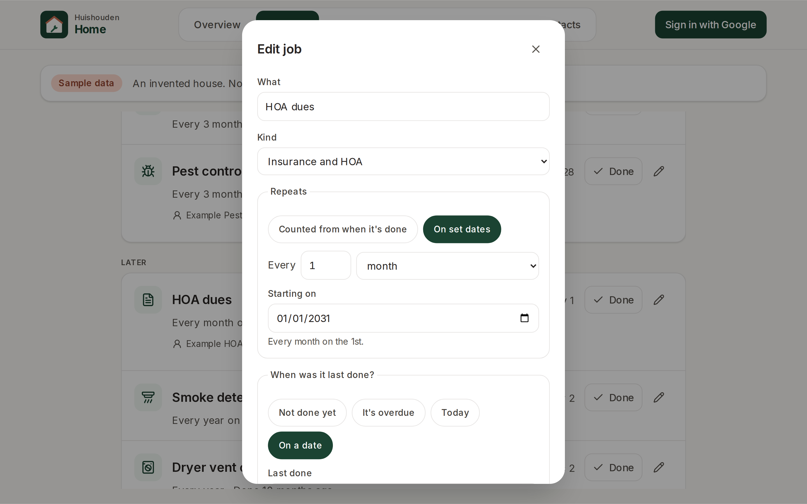 |

| Regular events | Moving one occurrence |
|---|---|
| 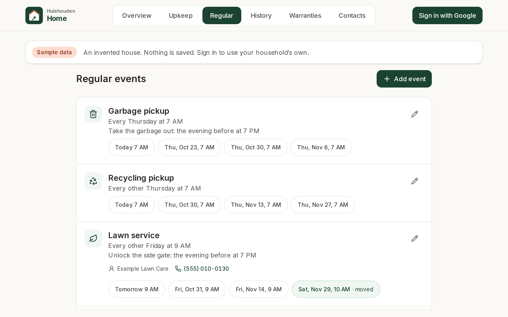 | 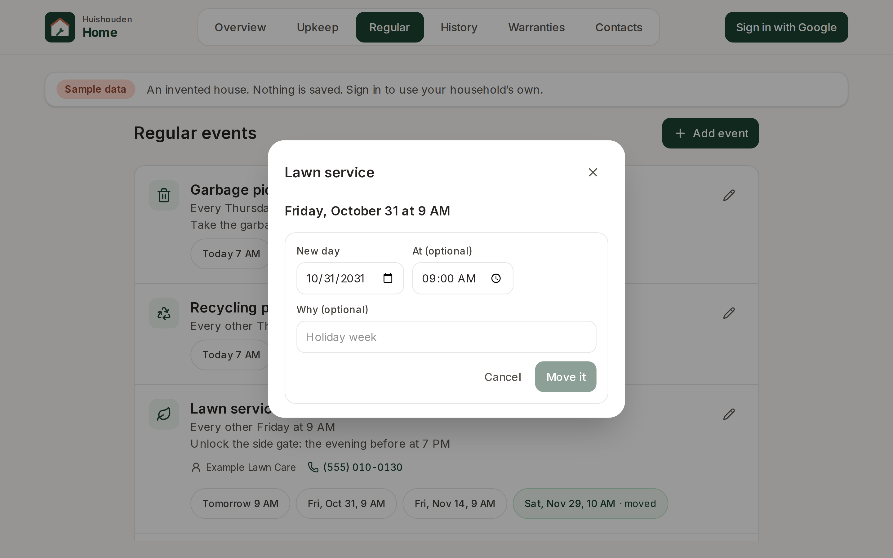 |

| Something to do before, done | An event's schedule |
|---|---|
| 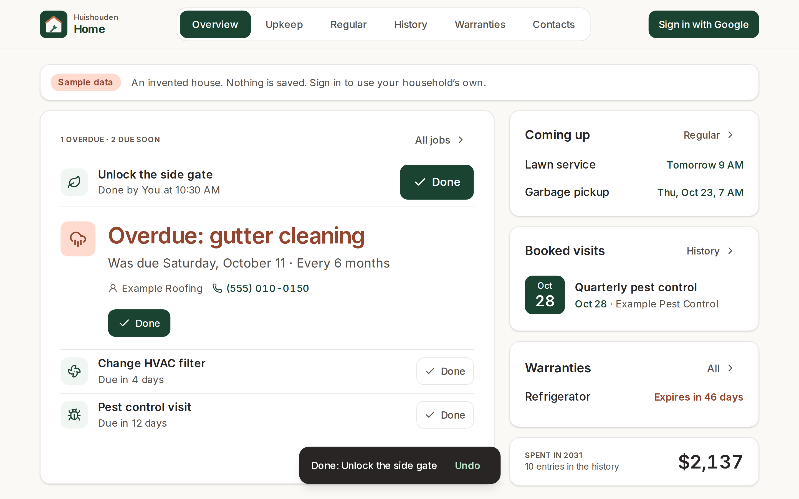 | 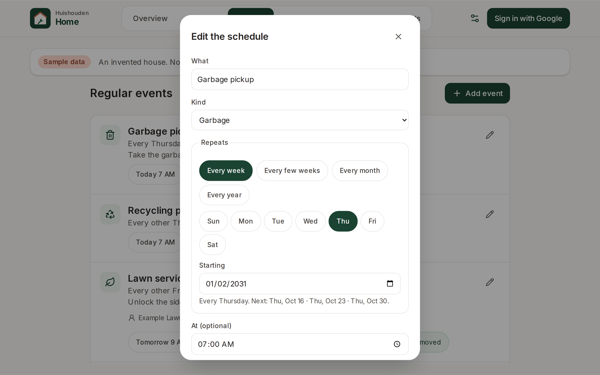 |

| Contacts | Import from calendar |
|---|---|
| 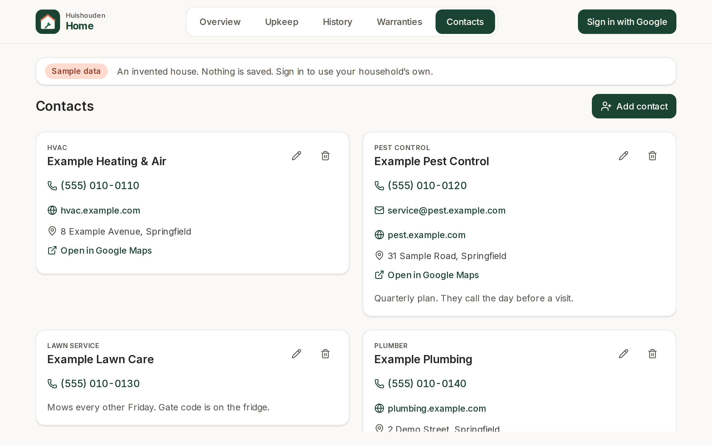 | 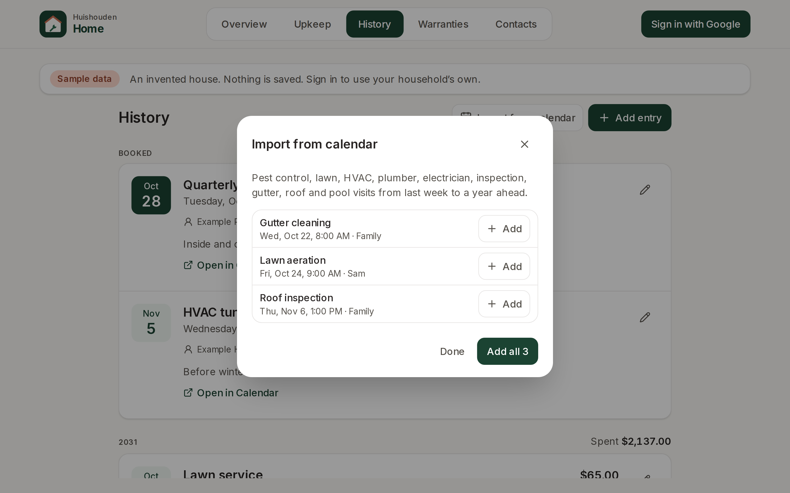 |

| Phone: overview | Phone: upkeep |
|---|---|
| 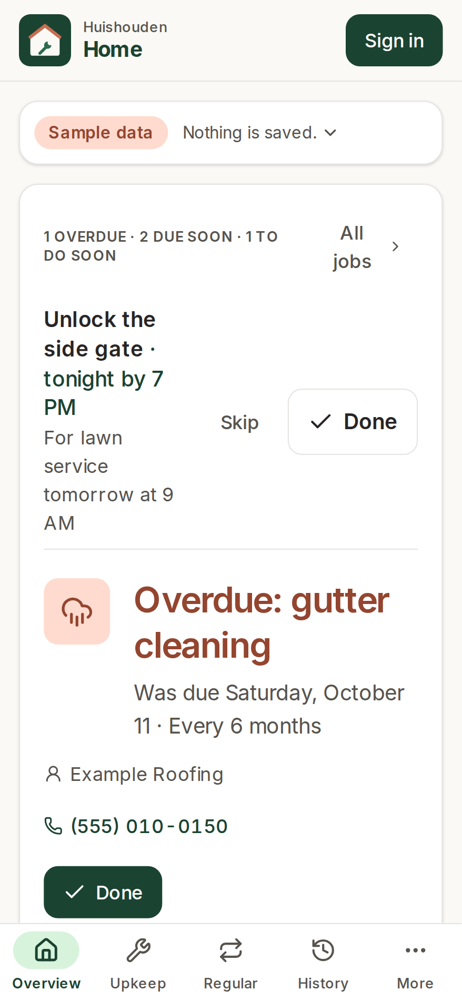 | 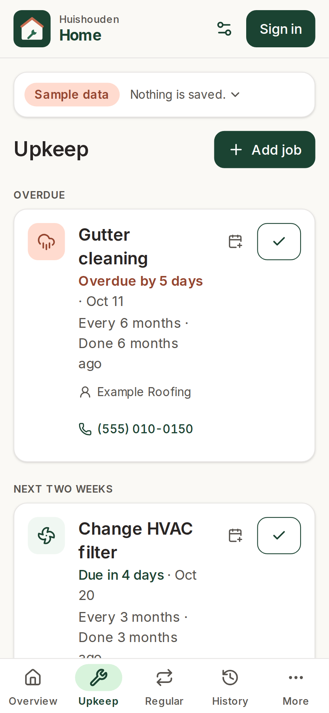 |

_Screenshots of the live site signed out, which shows an invented sample house dated October 2031. Refreshed by CI after each deploy._

## How schedules work

A job repeats in one of two ways:

- **Counted from when it's done**: "every 3 months" for an HVAC filter. Marking it done sets the next
  due date one interval after that day.
- **On set dates**: "every month on the 1st" for HOA dues, "every year on February 1" for an
  insurance renewal. Marking it done moves to the next date after both the due date and the day it
  was done, so doing an overdue job once covers the missed dates.

A new job asks "When was it last done?" and is never assumed done. "Not done yet, it's due now" (the
default) makes a counted job due today, so it shows as needing doing; a job on set dates goes on its
next date, or on the date that passed with "It's overdue". "Today" or a past day counts from that day,
which can make it overdue straight away. Next due follows the answer as it changes and can be set by
hand. Editing a job changes its last-done day and next due date the same way.

Months clamp to the month's last day (January 31 plus a month is February 28) and keep the 31st for
later months. Everything is in local calendar days. Adding a past history entry for a job also marks
the job done on that day when it is the latest time it was done; a future entry is a booked visit.

## Regular events

Some things come and go on a schedule without anyone completing them: garbage and recycling pickup,
a lawn service every other Friday, the HOA meeting on the second Tuesday. Each repeats weekly on
chosen weekdays, every few weeks, monthly (on a day, or the nth or last weekday) or yearly
(`EventRule` in `@huishouden/pwa-kit/schedule`).

- **One occurrence changes, the schedule doesn't.** Tap a date to move that one (a holiday week) or
  skip it; the change is kept against the day the schedule put it on, so "Back to Fri, Oct 31" undoes it.
- **Something to do before.** "Take the garbage out, the evening before at 7 PM" shows in Needs
  doing on the overview from 14 hours ahead, with a big Done toggle, who did it and when, and Undo.
  Not done by its time it turns terracotta; once the event begins it shows as missed for the rest of
  that day. With a reminder on, every device gets a push notification at that time, unless it is
  already done (ticked here or on the portal's To-do list) or the event is removed by then.
- **On the household calendar.** Each occurrence of the next 60 days goes on the portal's Calendar
  and Today (lawn, cleaning and HOA as appointments, pickups as other), and each thing to do before
  as a task: upcoming, overdue once its time passes, done once ticked.
- **From the calendar.** A garbage, trash, recycling, lawn or landscaping event that repeats in
  Google Calendar is offered as one regular event (new-in-your-calendar card, and Import from calendar),
  with its schedule and time filled in.

## Data

Signed-in members of a Huishouden household read and write under `households/{householdId}`:

| Collection | Fields |
|---|---|
| `homeTasks` | `title`, `category`, `schedule` (`kind`, `every`, `unit`, `anchor` for set dates), `due`, `lastDone`, `contactId`, `notes`, `calendarEventId`, `calendarLink`, `createdAt`, `updatedAt`, `by` |
| `homeServiceLog` | `date`, `title`, `taskId`, `contactId`, `who`, `costCents`, `notes`, `calendarEventId`, `calendarLink`, `createdAt`, `updatedAt`, `by` |
| `homeWarranties` | `item`, `details`, `purchaseDate`, `warrantyEnd`, `receiptUrl`, `manualUrl`, `contactId`, `notes`, `createdAt`, `updatedAt`, `by` |
| `homeEvents` | `title`, `kind` (`trash`, `recycling`, `yard waste`, `lawn`, `hoa`, `cleaning`, `other`), `rule`, `time` (`HH:MM`), `contactId`, `notes`, `prep` (`title`, `offset` `{ daysBefore, time }`, `remind`), `exceptions` (by original day: `moved` `{ date, time }`, `skipped`, `note`), `createdAt`, `updatedAt`, `by` |
| `homeEventPrep` | id `<eventId>_<original day>`: `done` (true), `at`, `by` |

Dates are `YYYY-MM-DD`; costs are whole cents. The documents are built in `src/lib/model.ts` with exactly
these keys, which the Firestore rules (in [huishouden/rules](https://github.com/huishouden/rules), the repo that
owns the project's rules file) accept and nothing more. Providers live in the household-wide `contacts` collection
shared by every app (`@huishouden/pwa-kit/contacts`); Home shows those whose `apps` include `home`. Signing in uses
Google with no extra scopes; the household comes from the shared `households` document, so one invite from the
portal opens every Huishouden app.

Home also publishes to the household agenda (`households/{householdId}/agenda`, through
`@huishouden/pwa-kit/agenda`), which the portal shows as one calendar and a Today view. Every member
can read it, so it carries only titles, schedules and contact names:

| Kind | From | Status |
|---|---|---|
| `due` | each job's next due date, with its schedule and contact | `upcoming`, `overdue` once the day has passed |
| `appointment` | history entries booked ahead (dated after the day they were added), with the contact | none |
| `renewal` | a warranty's end date ("Dishwasher warranty ends"), with its details | none |

Items are all-day, cover 30 days back to 180 days ahead (overdue jobs whatever their age), and link to
`#upkeep`, `#history` or `#warranties`. Each save updates its record's items; opening the app
reconciles everything. The signed-out sample house writes nothing. The mapping is `src/lib/agenda.ts`.

It also publishes its open things to the household to-do list (`households/{householdId}/todos`,
through `@huishouden/pwa-kit/todos`), which the portal's To-do tab shows with Done and a cancel:

| Ref | What | Done | Cancel |
|---|---|---|---|
| `job:<id>` | jobs overdue or due in the next two weeks, not paused; added when the job was | lastDone today, next due, and a history entry (everyone) | Pause (admins, members, whoever added it) |
| `prep:<eventId>_<day>` | the thing to do before a regular event, from when Overview shows it until the event begins; added when it came up (14 hours before its deadline) | ticked in the member's name (everyone) | Skip: ticked as skipped (everyone) |

A paused job keeps its schedule but is due nowhere (Overview, the agenda, the to-do list); Upkeep lists
it under Paused with Resume. A skipped thing to do before shows as Skipped on Overview. The list is
synced on open and a few seconds after each change. The mapping is `src/lib/todos.ts`.

Find in my calendar and Import from calendar read Google Calendar (read-only) through
`@huishouden/pwa-kit/calendar`; Google asks once for permission the first time. Find a business looks
places up on OpenStreetMap (`@huishouden/pwa-kit/places`), only when Search is pressed.

The house's address: with the household's home set (the portal's Household panel,
`households/{id}.home` through `@huishouden/pwa-kit/home`), the overview's upkeep card ends with the
address and a link to it on OpenStreetMap, which every member sees, helpers and kids included.
Without one, admins and members see a link to set it in the portal. Contacts with a position
(`lat`/`lng`, saved from the map search or looked up on save) say how far they are from home. The
signed-out sample has an invented home in Springfield; `?home=none` shows it without one.

## Privacy

Household data lives in the household's own Firestore documents, visible only to its members.
To catch problems early, the app sends reports to New Relic (free tier) through
`@huishouden/pwa-kit/observability`: errors (emails, ids, query strings and long numbers removed),
Core Web Vitals and page loads, the app version, device type, and the country and region New Relic
derives from the request; and anonymous usage counts per visit: `mark job done`, `save job`, `log service`, `save warranty`, and which tab is open. Households are counted by a
hash of the id. No names, emails, entries, free text or precise location, and no cookie or stored
id: nothing links one visit to the next. When the browser sends Global Privacy Control or Do Not
Track, usage counts are skipped; errors and speed still go. Local builds, staging and automated
browsers send nothing. The page people see is
[huishouden-piekstra.web.app/privacy](https://huishouden-piekstra.web.app/privacy); details in pwa-kit
[docs/observability.md](https://github.com/huishouden/pwa-kit/blob/main/docs/observability.md).

## Develop

```sh
bun install          # also enables the pre-commit leak scan
bun run env:pull     # writes .env.local from the repo's VITE_* variables
bun run dev          # http://localhost:3004
bun run lint && bun run test && bunx pwa-design-check && bun run build
bun run e2e          # Playwright smoke and sample-data feature tests against the live site (BASE_URL to override)
bun run screenshots  # README screenshots (SCREENSHOT_DIR to override)
bun run icons        # regenerate the logo and PNG icons
```

Built on [huishouden-pwa-kit](https://github.com/huishouden/pwa-kit) and follows its
[design language](https://github.com/huishouden/pwa-kit/blob/main/DESIGN.md) and
[standard](https://github.com/huishouden/pwa-kit/blob/main/STANDARD.md). Pushes to `main` upload the hashed build files to the suite's asset CDN (the
Cloudflare Worker `huishouden-assets`, with the repo secrets `CLOUDFLARE_API_TOKEN` and
`CLOUDFLARE_ACCOUNT_ID`; the variable `HH_ASSET_CDN=off` turns it off) and deploy the pages to
Firebase Hosting (project `huishouden-piekstra`, site `huishouden-home`), then run the smoke tests and refresh the screenshots.

## License

Source available under [PolyForm Shield 1.0.0](LICENSE): you may use, study and modify this code
for any purpose except providing a product that competes with Huishouden.

Huishouden and its logo are the project's brand; please don't use them for other products.
